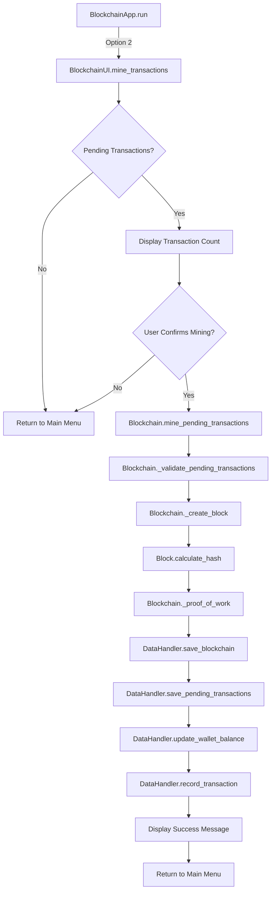
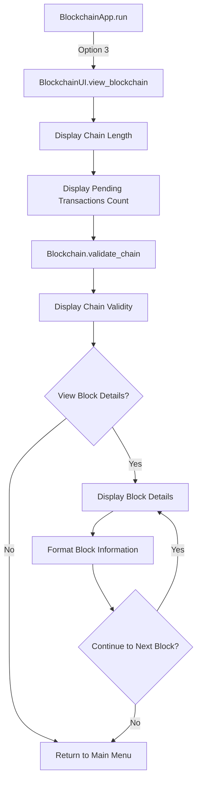
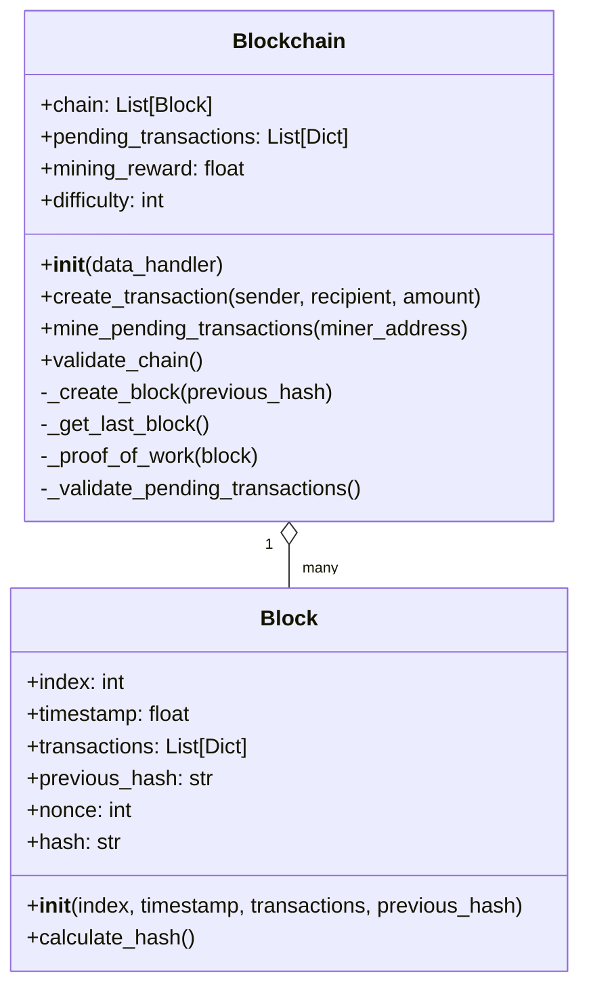

# ⛓️ Blockchain Function Flow Diagram

This document visualizes the function call sequence during blockchain-related operations.

## Mine Transactions Flow

## View Blockchain Flow

## Function Call Sequence: Mine Transactions

### Initialization Phase

1. `BlockchainApp.run()` → `BlockchainUI.mine_transactions(current_wallet)`
   - Receives the current wallet as an argument
   - This wallet will receive the mining reward

### Validation Phase

2. Check pending transactions
   - Get count from `blockchain.pending_transactions`
   - If no pending transactions, display message and return to main menu

### Confirmation Phase

3. Display pending transaction count
   - Show how many transactions will be processed
   
4. Get user confirmation
   - If not confirmed, return to main menu

### Mining Phase

5. `Blockchain.mine_pending_transactions(miner_address)`
   - Validates pending transactions with `_validate_pending_transactions()`
   - Creates a new block with `_create_block()`
   - Calculates block hash with `Block.calculate_hash()`
   - Performs proof of work with `_proof_of_work()`
   - Adds the new block to the chain
   - Creates a reward transaction for the miner
   
6. Save blockchain state
   - `DataHandler.save_blockchain()`
   - `DataHandler.save_pending_transactions()` (which is now empty)
   
7. Process mining reward
   - `DataHandler.update_wallet_balance()` to add reward to miner's wallet
   - `DataHandler.record_transaction()` to record the reward transaction
   
8. Display success message and return to main menu

## Function Call Sequence: View Blockchain

### Display Blockchain Info Phase

1. `BlockchainApp.run()` → `BlockchainUI.view_blockchain()`
   
2. Display basic blockchain information
   - Chain length (number of blocks)
   - Pending transaction count
   
3. `Blockchain.validate_chain()`
   - Validates the integrity of the entire blockchain
   - Returns boolean indicating validity
   
4. Display chain validity

### Block Details Phase

5. Get user input on whether to view block details
   - If no, return to main menu
   
6. If yes, for each block in the chain:
   - Display block header information (index, timestamp, hashes, nonce)
   - If not genesis block, display transactions in the block
   - Format addresses using contact names where available
   
7. After displaying all blocks, return to main menu

## Blockchain Data Structure

The blockchain consists of a chain of blocks with the following structure:

## Return to Main Documentation

[Return to Function Flows Documentation](../FUNCTION_FLOWS.md)
