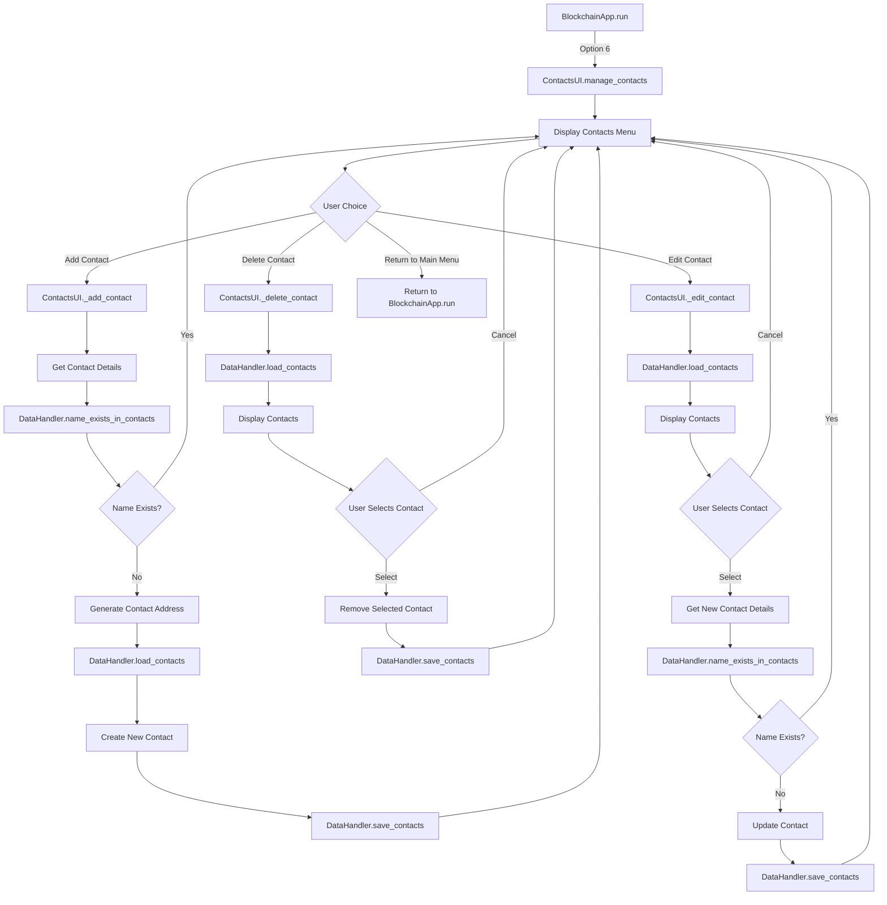
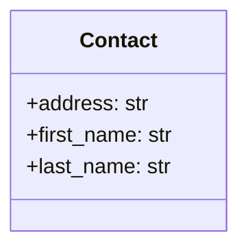

# 👥 Contact Management Function Flow Diagram

This document visualizes the function call sequence during contact management operations.

## Manage Contacts Flow

## Function Call Sequence: Manage Contacts

### Initialization Phase

1. `BlockchainApp.run()` → `ContactsUI.manage_contacts()`
   
2. Display contacts management menu
   - Show existing contacts
   - Present options:
     - Add New Contact (1)
     - Delete Contact (2)
     - Edit Contact (3)
     - Return to Main Menu (4)

### Process User Choice

3. Based on user selection:
   - If Add Contact (1): Call `ContactsUI._add_contact()`
   - If Delete Contact (2): Call `ContactsUI._delete_contact(contacts)`
   - If Edit Contact (3): Call `ContactsUI._edit_contact(contacts)`
   - If Return to Main Menu (4): Exit the contacts management loop

4. After each operation, return to the contacts management menu until the user chooses to exit

## Function Call Sequence: Add Contact

### Data Collection Phase

1. `ContactsUI.manage_contacts()` → `ContactsUI._add_contact()`
   
2. Get contact information from user:
   - First name: validated with `validate_name()`
   - Last name: validated with `validate_name()`

### Validation Phase

3. `DataHandler.name_exists_in_contacts(first_name, last_name)`
   - Check if a contact with the same name already exists
   - If exists, show error and return to contacts menu

### Contact Creation Phase

4. Generate contact address
   - Create a unique UUID for the contact
   
5. `DataHandler.load_contacts()`
   - Load existing contacts to append the new one
   
6. Create new contact object
   - Include first name, last name, and address
   
7. `DataHandler.save_contacts()`
   - Save updated contacts list with the new contact
   
8. Return to contacts management menu

## Function Call Sequence: Delete Contact

### Selection Phase

1. `ContactsUI.manage_contacts()` → `ContactsUI._delete_contact(contacts)`
   - Receives the list of contacts as an argument
   
2. Display contact list
   - Show all contacts with numbers for selection
   - Provide option to cancel
   
3. Get user selection
   - If canceled, return to contacts menu
   - If valid selection, proceed to deletion

### Deletion Phase

4. Remove the selected contact from the contacts list
   
5. `DataHandler.save_contacts()`
   - Save updated contacts list without the deleted contact
   
6. Return to contacts management menu

## Function Call Sequence: Edit Contact

### Selection Phase

1. `ContactsUI.manage_contacts()` → `ContactsUI._edit_contact(contacts)`
   - Receives the list of contacts as an argument
   
2. Display contact list
   - Show all contacts with numbers for selection
   - Provide option to cancel
   
3. Get user selection
   - If canceled, return to contacts menu
   - If valid selection, proceed to editing

### Data Collection Phase

4. Get new contact information from user:
   - First name: validated with `validate_name()`
   - Last name: validated with `validate_name()`

### Validation Phase

5. `DataHandler.name_exists_in_contacts(first_name, last_name)`
   - Check if another contact with the same name already exists
   - If exists (and not the current contact), show error and return to contacts menu

### Update Phase

6. Update the selected contact with new information
   
7. `DataHandler.save_contacts()`
   - Save updated contacts list with the modified contact
   
8. Return to contacts management menu

## Contact Data Structure

Contacts are stored as dictionaries with the following structure:

## Return to Main Documentation

[Return to Function Flows Documentation](../FUNCTION_FLOWS.md)
