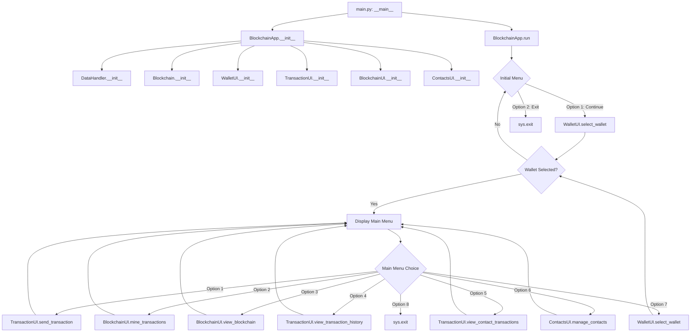
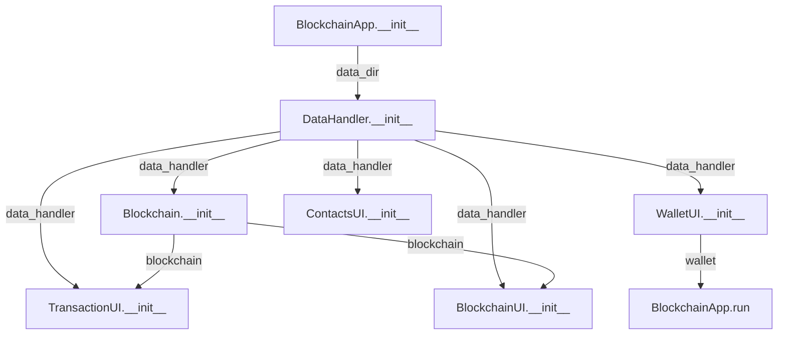

# 🚀 Application Startup Function Flow Diagram

This document visualizes the function call sequence during application startup.

## Startup Sequence

## Function Call Sequence

### Initialization Phase

1. `main.py` → `__main__` block
   - Creates the BlockchainApp instance
   - Calls `app.run()`

2. `BlockchainApp.__init__()`
   - Sets up directory paths
   - Initializes DataHandler with the parent directory path
   - Initializes Blockchain with the DataHandler
   - Initializes UI components:
     - WalletUI
     - TransactionUI
     - BlockchainUI
     - ContactsUI
   - Sets current_wallet to None

### Initial Menu Phase

3. `BlockchainApp.run()`
   - Displays the initial menu with two options:
     - Option 1: Continue to application
     - Option 2: Exit
   - If Option 2 is selected:
     - Displays exit message
     - Calls `sys.exit(0)`
   - If Option 1 is selected:
     - Continues to wallet selection

### Wallet Selection Phase

4. `WalletUI.select_wallet()`
   - Calls `DataHandler.load_wallets()`
   - Displays existing wallets
   - Provides options:
     - Select an existing wallet
     - Create a new wallet (calls `WalletUI.create_wallet()`)
     - Cancel operation
   - Returns selected wallet or None
   
5. Back to `BlockchainApp.run()`
   - If no wallet selected, prompts user and returns to initial menu
   - If wallet selected, displays user info and proceeds to main menu

### Main Menu Phase

6. Main Menu in `BlockchainApp.run()`
   - Displays the main menu with options
   - Gets user choice
   - Routes to appropriate UI method based on choice
   - After UI method completes, returns to main menu loop

## Data Flow

During the startup sequence, the following data is passed between functions:

## Return to Main Documentation

[Return to Function Flows Documentation](../FUNCTION_FLOWS.md)
