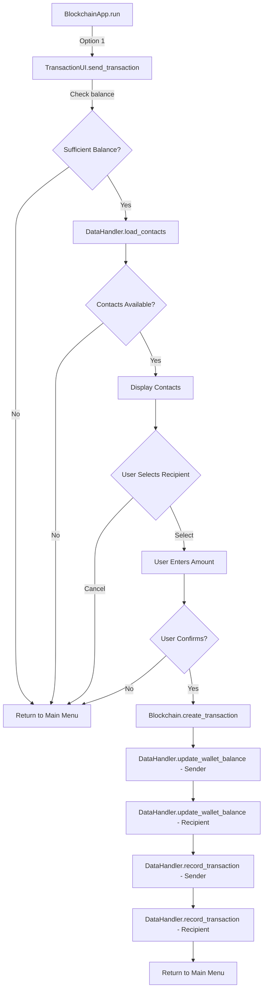
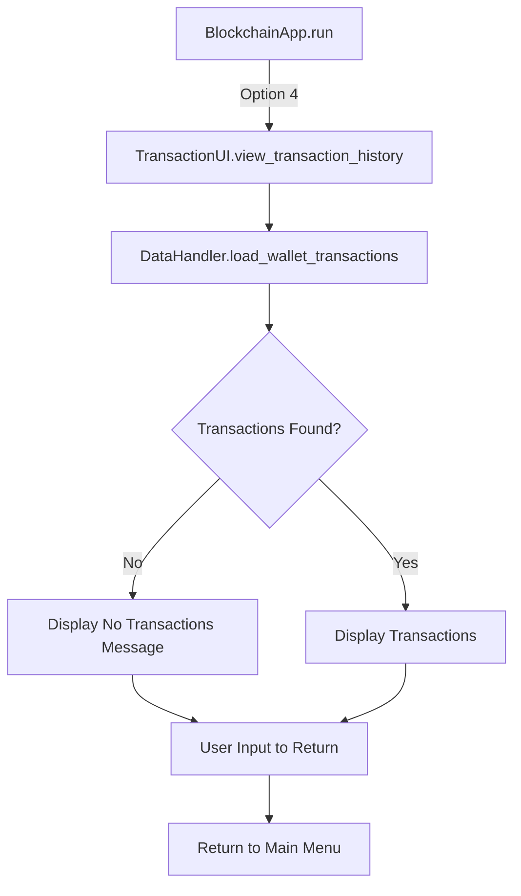
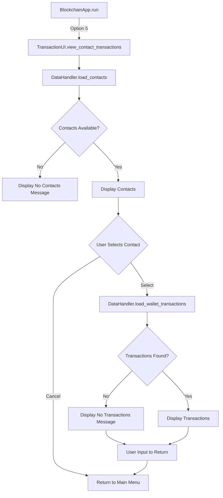

# 💸 Transaction Function Flow Diagram

This document visualizes the function call sequence during transaction-related operations.

## Send Transaction Flow

## View Transaction History Flow

## View Contact Transactions Flow

## Function Call Sequence: Send Transaction

### Initialization Phase

1. `BlockchainApp.run()` → `TransactionUI.send_transaction(current_wallet)`
   - Receives the current wallet as an argument
   - Extracts sender address and balance

### Validation Phase

2. Check sender balance
   - If insufficient, display message and return to main menu
   
3. `DataHandler.load_contacts()`
   - Load potential recipients
   - Filter out the current wallet from contacts
   - If no contacts available, display message and return to main menu

### Selection Phase

4. Display recipient selection menu
   - List all available contacts
   - Provide option to cancel

5. Process user selection
   - If canceled, return to main menu
   - If valid selection, proceed to amount entry

### Transaction Creation Phase

6. Get transaction amount from user
   - Validate using `validate_positive_number()`
   - Ensure amount does not exceed balance

7. Confirm transaction
   - Display transaction details
   - Get confirmation from user
   - If not confirmed, return to main menu

### Transaction Processing Phase

8. `Blockchain.create_transaction()`
   - Create transaction with sender, recipient, and amount
   
9. Update wallet balances
   - `DataHandler.update_wallet_balance()` for sender (subtract amount)
   - `DataHandler.update_wallet_balance()` for recipient (add amount)
   
10. Record transaction
    - `DataHandler.record_transaction()` for sender
    - `DataHandler.record_transaction()` for recipient
    
11. Return to main menu

## Function Call Sequence: View Transaction History

1. `BlockchainApp.run()` → `TransactionUI.view_transaction_history(address)`
   - Receives wallet address as an argument
   
2. `DataHandler.load_wallet_transactions(address)`
   - Load all transactions for the specified wallet
   
3. Display transactions
   - Format and display using tabulate
   - If no transactions, display appropriate message
   
4. Wait for user input and return to main menu

## Function Call Sequence: View Contact Transactions

1. `BlockchainApp.run()` → `TransactionUI.view_contact_transactions()`
   
2. `DataHandler.load_contacts()`
   - Load all contacts
   - If no contacts, display message and return to main menu
   
3. Display contact selection menu
   - List all contacts
   - Provide option to cancel
   
4. Process user selection
   - If canceled, return to main menu
   - If valid selection, proceed to transaction loading
   
5. `DataHandler.load_wallet_transactions(address)`
   - Load all transactions for the selected contact
   
6. Display transactions
   - Format and display using tabulate
   - If no transactions, display appropriate message
   
7. Wait for user input and return to main menu

## Return to Main Documentation

[Return to Function Flows Documentation](../FUNCTION_FLOWS.md)
