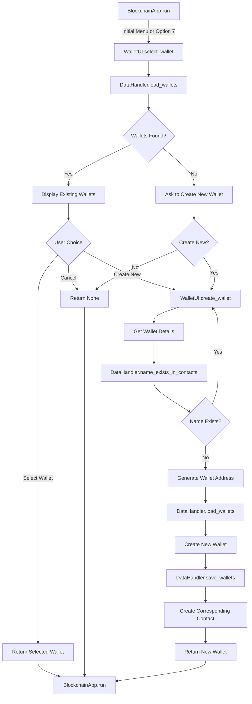
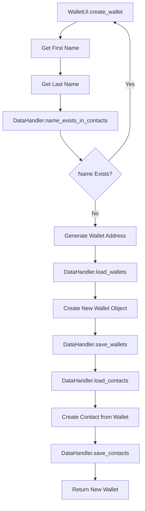
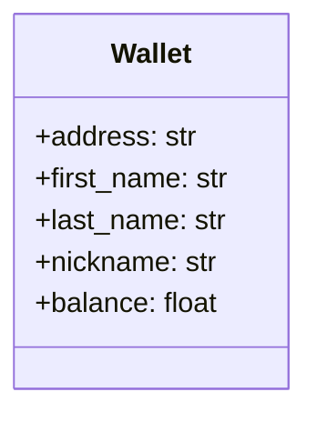

# 👛 Wallet Management Function Flow Diagram

This document visualizes the function call sequence during wallet-related operations.

## Select Wallet Flow

## Create Wallet Flow

## Function Call Sequence: Select Wallet

### Initialization Phase

1. `BlockchainApp.run()` → `WalletUI.select_wallet()`
   - Called at application startup or when switching wallets

2. `DataHandler.load_wallets()`
   - Load all existing wallets from storage

### Wallet Selection Phase

3. If wallets exist:
   - Display list of wallets with names and balances
   - Present options:
     - Select an existing wallet by number
     - Create a new wallet ('N')
     - Cancel operation ('X')
   
4. If no wallets exist:
   - Ask user if they want to create a new wallet
   - If yes, proceed to wallet creation
   - If no, return None (which will prompt user in main menu)

### Process User Choice

5. If user selects an existing wallet:
   - Validate selection
   - Return the selected wallet object
   
6. If user chooses to create a new wallet:
   - Call `WalletUI.create_wallet()`
   - Return the newly created wallet
   
7. If user cancels:
   - Return None to the calling function

## Function Call Sequence: Create Wallet

### Data Collection Phase

1. `WalletUI.select_wallet()` → `WalletUI.create_wallet()`
   
2. Get wallet information from user:
   - First name: validated with `validate_name()`
   - Last name: validated with `validate_name()`

### Validation Phase

3. `DataHandler.name_exists_in_contacts(first_name, last_name)`
   - Check if a contact with the same name already exists
   - If exists, show error and restart wallet creation process

### Wallet Creation Phase

4. Generate wallet address
   - Create a unique UUID for the wallet
   
5. `DataHandler.load_wallets()`
   - Load existing wallets to append the new one
   
6. Create new wallet object
   - Include first name, last name, address, and initial balance
   
7. `DataHandler.save_wallets()`
   - Save updated wallet list with the new wallet

### Contact Creation Phase

8. `DataHandler.load_contacts()`
   - Load existing contacts to append a new one
   
9. Create a contact from the wallet
   - Use the same name and address as the wallet
   
10. `DataHandler.save_contacts()`
    - Save updated contacts list with the new contact
    
11. Return the newly created wallet to the calling function

## Wallet Data Structure

Wallets are stored as dictionaries with the following structure:

Note: The wallet format supports both new wallets with a `nickname` field and older wallets with separate `first_name` and `last_name` fields.

## Return to Main Documentation

[Return to Function Flows Documentation](../FUNCTION_FLOWS.md)
