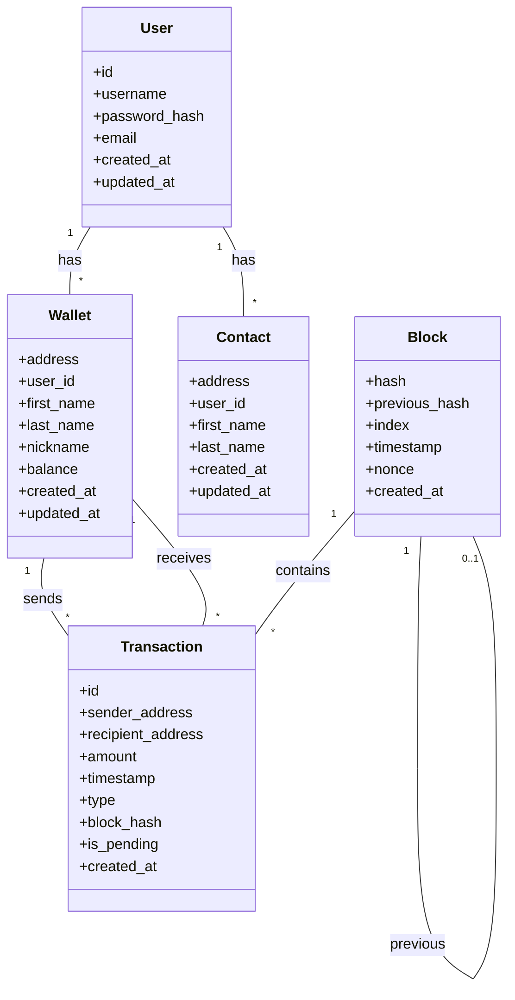

# 🗃️ Database Migration Plan

<div style="background-color: #f0fff0; padding: 15px; border-radius: 8px; border-left: 5px solid #2e8b57;">

This document details the plan for migrating from JSON file storage to a SQLite database for the blockchain application.

</div>

## 📋 Table of Contents

- [Current Data Storage](#current-data-storage)
- [SQLite Database Schema](#sqlite-database-schema)
- [SQLAlchemy Models](#sqlalchemy-models)
- [Migration Process](#migration-process)
- [Data Access Layer](#data-access-layer)
- [Testing Strategy](#testing-strategy)

## 📁 Current Data Storage

<div style="background-color: #f5f5f5; padding: 15px; border-radius: 8px; border-left: 5px solid #696969;">

The current application uses JSON files for data storage:

1. **wallets.json** - Stores wallet information
   ```json
   [
     {
       "address": "123abc...",
       "first_name": "John",
       "last_name": "Doe",
       "nickname": "JohnD",
       "balance": 100.0
     }
   ]
   ```

2. **contacts.json** - Stores contact information
   ```json
   [
     {
       "address": "456def...",
       "first_name": "Jane",
       "last_name": "Smith"
     }
   ]
   ```

3. **blockchain.json** - Stores blockchain data
   ```json
   [
     {
       "index": 0,
       "timestamp": 1613461848.134969,
       "transactions": "Genesis Block",
       "previous_hash": "0",
       "nonce": 0,
       "hash": "7f83b..."
     }
   ]
   ```

4. **pending_transactions.json** - Stores pending transactions
   ```json
   [
     {
       "id": "789ghi...",
       "sender": "123abc...",
       "recipient": "456def...",
       "amount": 50.0,
       "timestamp": 1613461900.134969,
       "type": "PAYMENT"
     }
   ]
   ```

5. **completed_transactions.json** - Stores completed transactions
   ```json
   [
     {
       "id": "789ghi...",
       "sender": "123abc...",
       "recipient": "456def...",
       "amount": 50.0,
       "timestamp": 1613461900.134969,
       "type": "PAYMENT",
       "block_hash": "a1b2c3..."
     }
   ]
   ```

6. **Individual transaction files** - Within the `transactions` directory, containing transaction history for each wallet.

The current `DataHandler` class in `data/data_handler.py` manages all file operations.

</div>

## 💾 SQLite Database Schema

<div style="background-color: #e6f7ff; padding: 15px; border-radius: 8px; border-left: 5px solid #1890ff;">

### Database Tables

1. **users**
   - `id` (INTEGER, PK, AUTOINCREMENT)
   - `username` (TEXT, UNIQUE)
   - `password_hash` (TEXT)
   - `email` (TEXT, UNIQUE)
   - `created_at` (TIMESTAMP)
   - `updated_at` (TIMESTAMP)

2. **wallets**
   - `address` (TEXT, PK)
   - `user_id` (INTEGER, FK to users.id, nullable)
   - `first_name` (TEXT)
   - `last_name` (TEXT)
   - `nickname` (TEXT)
   - `balance` (REAL)
   - `created_at` (TIMESTAMP)
   - `updated_at` (TIMESTAMP)

3. **contacts**
   - `address` (TEXT, PK)
   - `user_id` (INTEGER, FK to users.id)
   - `first_name` (TEXT)
   - `last_name` (TEXT)
   - `created_at` (TIMESTAMP)
   - `updated_at` (TIMESTAMP)

4. **blocks**
   - `hash` (TEXT, PK)
   - `previous_hash` (TEXT, FK to blocks.hash, nullable)
   - `index` (INTEGER)
   - `timestamp` (TIMESTAMP)
   - `nonce` (INTEGER)
   - `created_at` (TIMESTAMP)

5. **transactions**
   - `id` (TEXT, PK)
   - `sender_address` (TEXT, FK to wallets.address)
   - `recipient_address` (TEXT, FK to wallets.address)
   - `amount` (REAL)
   - `timestamp` (TIMESTAMP)
   - `type` (TEXT)
   - `block_hash` (TEXT, FK to blocks.hash, nullable)
   - `is_pending` (BOOLEAN)
   - `created_at` (TIMESTAMP)

### Indexes

- `idx_wallets_user_id` on `wallets.user_id`
- `idx_contacts_user_id` on `contacts.user_id`
- `idx_transactions_sender` on `transactions.sender_address`
- `idx_transactions_recipient` on `transactions.recipient_address`
- `idx_transactions_block` on `transactions.block_hash`
- `idx_transactions_is_pending` on `transactions.is_pending`
- `idx_blocks_prev_hash` on `blocks.previous_hash`

### Constraints

- Foreign key constraints for all relationships
- Check constraints for non-negative balances
- Unique constraints for usernames, emails, and addresses

</div>

## 📊 SQLAlchemy Models

<div style="background-color: #fff8e1; padding: 15px; border-radius: 8px; border-left: 5px solid #ffc107;">

### Model Definitions

```python
# Example SQLAlchemy models (conceptual, not actual code)

from sqlalchemy import Column, Integer, String, Float, Boolean, ForeignKey, DateTime
from sqlalchemy.ext.declarative import declarative_base
from sqlalchemy.orm import relationship
import datetime

Base = declarative_base()

class User(Base):
    __tablename__ = 'users'
    
    id = Column(Integer, primary_key=True)
    username = Column(String, unique=True, nullable=False)
    password_hash = Column(String, nullable=False)
    email = Column(String, unique=True, nullable=False)
    created_at = Column(DateTime, default=datetime.datetime.utcnow)
    updated_at = Column(DateTime, default=datetime.datetime.utcnow, onupdate=datetime.datetime.utcnow)
    
    wallets = relationship('Wallet', back_populates='user')
    contacts = relationship('Contact', back_populates='user')

class Wallet(Base):
    __tablename__ = 'wallets'
    
    address = Column(String, primary_key=True)
    user_id = Column(Integer, ForeignKey('users.id'), nullable=True)
    first_name = Column(String)
    last_name = Column(String)
    nickname = Column(String)
    balance = Column(Float, default=0.0)
    created_at = Column(DateTime, default=datetime.datetime.utcnow)
    updated_at = Column(DateTime, default=datetime.datetime.utcnow, onupdate=datetime.datetime.utcnow)
    
    user = relationship('User', back_populates='wallets')
    sent_transactions = relationship('Transaction', 
                                    foreign_keys='Transaction.sender_address',
                                    back_populates='sender')
    received_transactions = relationship('Transaction', 
                                         foreign_keys='Transaction.recipient_address',
                                         back_populates='recipient')

class Contact(Base):
    __tablename__ = 'contacts'
    
    address = Column(String, primary_key=True)
    user_id = Column(Integer, ForeignKey('users.id'), nullable=False)
    first_name = Column(String, nullable=False)
    last_name = Column(String, nullable=False)
    created_at = Column(DateTime, default=datetime.datetime.utcnow)
    updated_at = Column(DateTime, default=datetime.datetime.utcnow, onupdate=datetime.datetime.utcnow)
    
    user = relationship('User', back_populates='contacts')

class Block(Base):
    __tablename__ = 'blocks'
    
    hash = Column(String, primary_key=True)
    previous_hash = Column(String, ForeignKey('blocks.hash'), nullable=True)
    index = Column(Integer, nullable=False)
    timestamp = Column(DateTime, nullable=False)
    nonce = Column(Integer, nullable=False)
    created_at = Column(DateTime, default=datetime.datetime.utcnow)
    
    previous_block = relationship('Block', remote_side=[hash], backref='next_block', uselist=False)
    transactions = relationship('Transaction', back_populates='block')

class Transaction(Base):
    __tablename__ = 'transactions'
    
    id = Column(String, primary_key=True)
    sender_address = Column(String, ForeignKey('wallets.address'), nullable=True)
    recipient_address = Column(String, ForeignKey('wallets.address'), nullable=True)
    amount = Column(Float, nullable=False)
    timestamp = Column(DateTime, nullable=False)
    type = Column(String, nullable=False)
    block_hash = Column(String, ForeignKey('blocks.hash'), nullable=True)
    is_pending = Column(Boolean, default=True)
    created_at = Column(DateTime, default=datetime.datetime.utcnow)
    
    sender = relationship('Wallet', foreign_keys=[sender_address], back_populates='sent_transactions')
    recipient = relationship('Wallet', foreign_keys=[recipient_address], back_populates='received_transactions')
    block = relationship('Block', back_populates='transactions')
```

### Relationship Overview



</div>

## 🔄 Migration Process

<div style="background-color: #f9f0ff; padding: 15px; border-radius: 8px; border-left: 5px solid #9c27b0;">

### Migration Strategy

1. **Setup Database**
   - Create SQLite database file
   - Initialize schema using SQLAlchemy models
   - Create database indexes

2. **Data Migration Script**
   - Read existing JSON files
   - Transform data to match new schema
   - Insert into SQLite tables
   - Validate data integrity

3. **User Account Creation**
   - Create default admin user
   - Associate existing wallets with the admin user

### Migration Script

```python
# Example migration script concept (not actual code)

def migrate_data():
    # Setup database
    engine = create_engine('sqlite:///blockchain.db')
    Base.metadata.create_all(engine)
    Session = sessionmaker(bind=engine)
    session = Session()
    
    # Create admin user
    admin_user = User(
        username="admin",
        password_hash=generate_password_hash("admin_password"),
        email="admin@example.com"
    )
    session.add(admin_user)
    session.commit()
    
    # Migrate wallets
    wallets_data = load_json_file("wallets.json")
    for wallet_data in wallets_data:
        wallet = Wallet(
            address=wallet_data["address"],
            user_id=admin_user.id,
            first_name=wallet_data.get("first_name", ""),
            last_name=wallet_data.get("last_name", ""),
            nickname=wallet_data.get("nickname", ""),
            balance=wallet_data["balance"]
        )
        session.add(wallet)
    
    # Similar migrations for contacts, blockchain, transactions
    
    session.commit()
```

### Testing Migration

1. **Validation Queries**
   - Count records in each table
   - Verify key relationships
   - Check data integrity

2. **Data Verification**
   - Compare wallet balances
   - Verify transaction history
   - Check blockchain integrity

</div>

## 📂 Data Access Layer

<div style="background-color: #e8f4fd; padding: 15px; border-radius: 8px; border-left: 5px solid #2196f3;">

### New DataHandler Implementation

The `DataHandler` class will be reimplemented to use SQLAlchemy instead of JSON files while maintaining the same interface:

```python
# Example of the new DataHandler (conceptual, not actual code)

class DataHandler:
    def __init__(self, db_session):
        self.session = db_session
    
    # Wallet methods
    def load_wallets(self):
        """Load all wallets from the database."""
        wallets = self.session.query(Wallet).all()
        # Convert SQLAlchemy objects to dictionaries
        return [wallet.to_dict() for wallet in wallets]
    
    def save_wallets(self, wallets_data):
        """Update wallets in the database."""
        for wallet_data in wallets_data:
            wallet = self.session.query(Wallet).get(wallet_data["address"])
            if wallet:
                # Update existing wallet
                wallet.first_name = wallet_data.get("first_name", wallet.first_name)
                wallet.last_name = wallet_data.get("last_name", wallet.last_name)
                wallet.nickname = wallet_data.get("nickname", wallet.nickname)
                wallet.balance = wallet_data["balance"]
            else:
                # Create new wallet
                wallet = Wallet(
                    address=wallet_data["address"],
                    first_name=wallet_data.get("first_name", ""),
                    last_name=wallet_data.get("last_name", ""),
                    nickname=wallet_data.get("nickname", ""),
                    balance=wallet_data["balance"]
                )
                self.session.add(wallet)
        self.session.commit()
    
    # Similar methods for other data types...
```

### Adapting Existing Code

1. **Initialization**
   - Create database session in FastAPI application startup
   - Pass session to `DataHandler` constructor

2. **Dependency Injection**
   - Use FastAPI's dependency injection system
   - Provide data handler to API endpoints

3. **Transaction Management**
   - Use SQLAlchemy's transaction support
   - Ensure atomicity for complex operations

</div>

## 🧪 Testing Strategy

<div style="background-color: #fff2f0; padding: 15px; border-radius: 8px; border-left: 5px solid #ff4d4f;">

### Data Migration Testing

1. **Unit Tests**
   - Test each migration function
   - Verify correct data transformation

2. **Integration Tests**
   - Test complete migration process
   - Verify database state after migration

3. **Data Validation**
   - Compare original JSON data with migrated database
   - Ensure no data loss or corruption

### Database Layer Testing

1. **ORM Model Tests**
   - Test model relationships
   - Verify constraints

2. **CRUD Operation Tests**
   - Test create, read, update, delete operations
   - Verify transaction isolation

3. **Performance Tests**
   - Benchmark common queries
   - Test with larger datasets

### Rollback Plan

1. **Backup Strategy**
   - Create backup of JSON files before migration
   - Implement database backup solution

2. **Rollback Procedure**
   - Script to restore from JSON backups
   - Instructions for manual restoration if needed

</div>

## 📚 Conclusion

<div style="background-color: #f0f2f5; padding: 15px; border-radius: 8px; border-left: 5px solid #8c8c8c;">

Migrating from JSON files to a SQLite database will provide several benefits:

1. **Improved Data Integrity** - Enforced relationships and constraints
2. **Better Query Performance** - Indexed lookups instead of full file reads
3. **Transaction Support** - ACID compliance for data operations
4. **Scalability** - Easier path to more powerful databases in the future

The migration process outlined in this document provides a structured approach to transitioning the existing data while maintaining compatibility with the business logic layer of the application.

</div>
