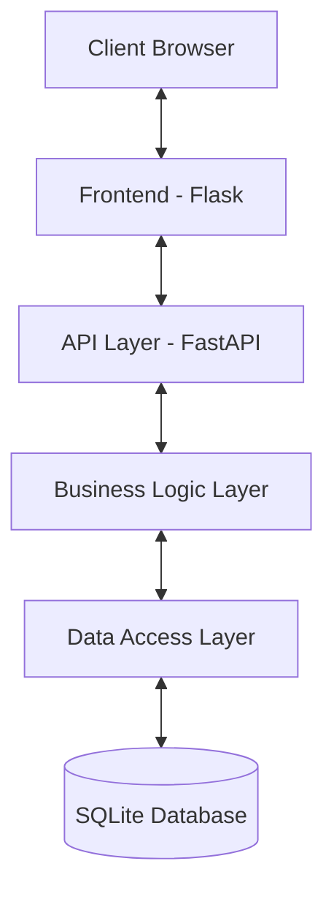
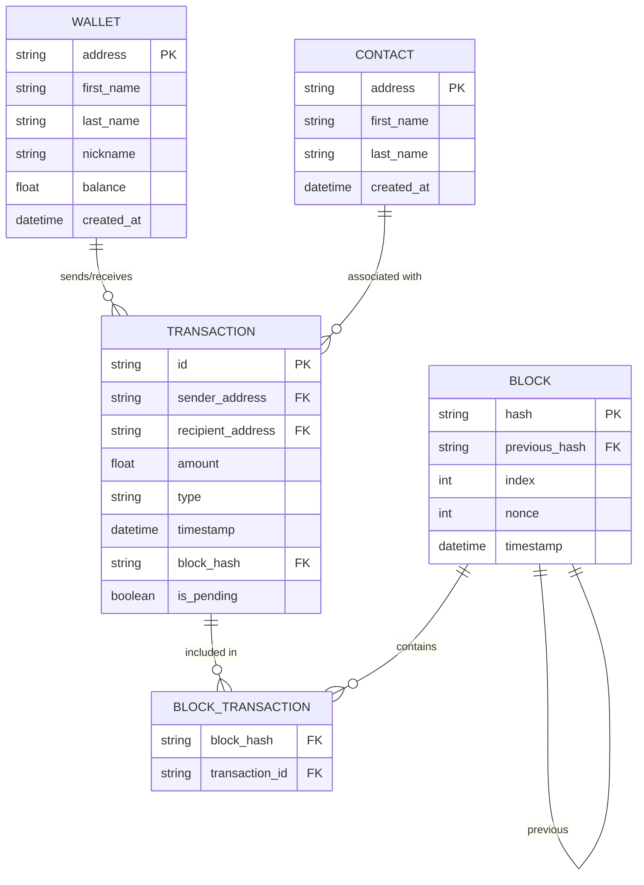

# 🌐 Web Interface Design Document

<div style="background-color: #f0f8ff; padding: 15px; border-radius: 8px; border-left: 5px solid #1e90ff;">

This document outlines the design for migrating the blockchain application from a terminal-based interface to a web-based interface using FastAPI and Flask, with SQLite as the database.

</div>

## 📋 Table of Contents

- [Technology Stack](#technology-stack)
- [Architecture Overview](#architecture-overview)
- [Database Design](#database-design)
- [API Design](#api-design)
- [Frontend Design](#frontend-design)
- [Code Migration Strategy](#code-migration-strategy)
- [Security Considerations](#security-considerations)
- [Implementation Roadmap](#implementation-roadmap)

## 🛠️ Technology Stack

<div style="background-color: #f5f5f5; padding: 15px; border-radius: 8px; border-left: 5px solid #696969;">

### Recommended Technologies

1. **Backend Framework**: FastAPI (preferred over Flask or Django)
   - FastAPI is chosen for its high performance, automatic API documentation, and modern Python features
   - More suitable than Django for this project size
   - More modern than Flask with better type hints and validation

2. **Database**: SQLite
   - Suitable for the application scale
   - File-based, easy to set up and manage
   - Can be migrated to PostgreSQL later if needed

3. **ORM**: SQLAlchemy
   - Works well with FastAPI
   - Provides database abstraction
   - Allows future migration to other databases

4. **Frontend**: HTML, CSS, JavaScript with a modern framework
   - Vue.js (recommended for simplicity)
   - Or React/Angular if preferred
   - Bootstrap for responsive design

5. **Authentication**: JWT (JSON Web Tokens)
   - Stateless authentication
   - Works well with modern web applications

</div>

## 🏗️ Architecture Overview

<div style="background-color: #e6f7ff; padding: 15px; border-radius: 8px; border-left: 5px solid #1890ff;">

### Three-Tier Architecture



### Components

1. **Presentation Layer** (Frontend - Flask)
   - Serves HTML, CSS, and JavaScript
   - Provides user interfaces for all features
   - Communicates with the API layer

2. **API Layer** (FastAPI)
   - RESTful API endpoints 
   - Request/response validation
   - Authentication/authorization
   - Error handling

3. **Business Logic Layer** (Reused from existing app)
   - Core blockchain functionality
   - Transaction processing
   - Mining logic
   - Wallet management

4. **Data Access Layer**
   - SQLAlchemy ORM models
   - Database operations
   - Migration from JSON files to SQLite

5. **Database Layer**
   - SQLite database
   - Tables for blockchain, wallets, transactions, contacts

### Interaction Flow

1. User interacts with the Flask frontend
2. Frontend makes API calls to FastAPI endpoints
3. FastAPI routes requests to appropriate business logic
4. Business logic processes requests and interacts with data layer
5. Data layer performs database operations
6. Results flow back up through the layers

</div>

## 💾 Database Design

<div style="background-color: #f0fff0; padding: 15px; border-radius: 8px; border-left: 5px solid #2e8b57;">

### Database Schema



### Migration from JSON Files

1. **Create SQLite Database**
   - Define models using SQLAlchemy
   - Create initial migration scripts

2. **Data Migration**
   - Read existing JSON files
   - Insert data into SQLite tables
   - Validate data integrity after migration

3. **Schema Considerations**
   - Add created_at/updated_at timestamps
   - Add proper foreign key relationships
   - Normalize data where appropriate

</div>

## 🔌 API Design

<div style="background-color: #fff8e1; padding: 15px; border-radius: 8px; border-left: 5px solid #ffc107;">

### RESTful API Endpoints

#### Authentication
- `POST /api/auth/login` - Get authentication token
- `POST /api/auth/register` - Register new user

#### Wallets
- `GET /api/wallets` - List all wallets
- `GET /api/wallets/{address}` - Get wallet details
- `POST /api/wallets` - Create new wallet
- `GET /api/wallets/{address}/transactions` - Get wallet transactions
- `GET /api/wallets/{address}/balance` - Get wallet balance

#### Transactions
- `GET /api/transactions` - List transactions
- `POST /api/transactions` - Create transaction
- `GET /api/transactions/{id}` - Get transaction details
- `GET /api/transactions/pending` - Get pending transactions

#### Blockchain
- `GET /api/blockchain` - Get blockchain info
- `GET /api/blockchain/blocks` - List blocks
- `GET /api/blockchain/blocks/{hash}` - Get block details
- `POST /api/blockchain/mine` - Mine new block

#### Contacts
- `GET /api/contacts` - List contacts
- `POST /api/contacts` - Create contact
- `GET /api/contacts/{address}` - Get contact details
- `PUT /api/contacts/{address}` - Update contact
- `DELETE /api/contacts/{address}` - Delete contact

### API Response Format

```json
{
  "success": true,
  "data": {},
  "message": "Operation successful",
  "errors": []
}
```

### API Documentation

- Auto-generated with FastAPI's Swagger/OpenAPI support
- Available at `/docs` endpoint
- Will include examples and schema information

</div>

## 🖥️ Frontend Design

<div style="background-color: #f9f0ff; padding: 15px; border-radius: 8px; border-left: 5px solid #9c27b0;">

### Flask Integration

Flask will serve as the frontend server, handling:
- Serving HTML pages
- User authentication (via the FastAPI backend)
- Page routing

### Key Views/Pages

1. **Auth Pages**
   - Login
   - Register

2. **Dashboard**
   - Overview of wallet balance
   - Recent transactions
   - Blockchain status

3. **Wallet Management**
   - Create wallet
   - Switch wallets
   - View wallet details

4. **Transactions**
   - Send transactions
   - View transaction history
   - View pending transactions

5. **Blockchain Explorer**
   - View blocks
   - Block details
   - Validate chain

6. **Mining Interface**
   - Mine pending transactions
   - View mining rewards

7. **Contact Management**
   - Add/edit/delete contacts
   - View contact details
   - View contact transactions

### UI Components

- Modern, responsive design
- Interactive blockchain visualization
- Real-time transaction updates
- Form validation

</div>

## 🔄 Code Migration Strategy

<div style="background-color: #e8f4fd; padding: 15px; border-radius: 8px; border-left: 5px solid #2196f3;">

### Core Business Logic Reuse

The following components can be largely reused:

1. **Blockchain Logic** (`blockchain/blockchain.py`)
   - Core blockchain functionality
   - Block creation and validation
   - Transaction validation
   - Proof of work algorithm

2. **Validation Logic** (`utils/validation.py`)
   - Input validation
   - Data integrity checks

### Required Adaptations

1. **Data Handler** (`data/data_handler.py`)
   - Replace JSON file operations with SQLAlchemy ORM
   - Maintain the same method signatures for compatibility
   - Example:
     ```python
     # Change from
     def load_wallets(self):
         return self.load_data(self.wallets_file)
     
     # To
     def load_wallets(self):
         return self.db_session.query(Wallet).all()
     ```

2. **UI Components** (`ui/*.py`)
   - Extract business logic from UI classes
   - Move terminal UI code to API endpoints
   - Example:
     ```python
     # Change from
     def send_transaction(self, current_wallet):
         # Terminal UI code mixed with business logic
     
     # To
     def process_transaction(self, sender_address, recipient_address, amount):
         # Pure business logic
     ```

3. **Main Application** (`main.py`)
   - Replace the BlockchainApp class with FastAPI application
   - Convert menu-based navigation to API endpoints

### New Components to Create

1. **SQLAlchemy Models**
   - Define ORM models for all entities
   - Implement relationships and constraints

2. **FastAPI Endpoints**
   - Create API routes
   - Implement request/response models
   - Add validation and error handling

3. **Authentication System**
   - Implement JWT-based authentication
   - User registration and login

4. **Flask Frontend**
   - Create templates and static files
   - Implement frontend routes
   - Handle API communication

</div>

## 🔒 Security Considerations

<div style="background-color: #fff2f0; padding: 15px; border-radius: 8px; border-left: 5px solid #ff4d4f;">

### Key Security Concerns

1. **Authentication**
   - Implement JWT with proper expiration
   - Secure password hashing (bcrypt)
   - HTTPS for all communications

2. **API Security**
   - Rate limiting
   - Input validation
   - CORS configuration

3. **Database Security**
   - Parameterized queries
   - Connection pooling
   - Backup strategy

4. **Blockchain Integrity**
   - Maintain consensus validation
   - Transaction verification
   - Prevent double-spending

5. **Frontend Security**
   - Cross-Site Scripting (XSS) prevention
   - Cross-Site Request Forgery (CSRF) protection
   - Content Security Policy (CSP)

</div>

## 📅 Implementation Roadmap

<div style="background-color: #f5f0ff; padding: 15px; border-radius: 8px; border-left: 5px solid #7b1fa2;">

### Phase 1: Foundation

1. Set up project structure
   - Create FastAPI application
   - Set up Flask frontend
   - Configure SQLAlchemy

2. Database Implementation
   - Define database models
   - Write migration scripts
   - Convert JSON data to SQLite

3. Core API Endpoints
   - Blockchain info
   - Wallet management
   - Basic transaction operations

### Phase 2: Feature Implementation

1. Authentication System
   - User registration
   - Login/logout
   - JWT implementation

2. Complete API Endpoints
   - All transaction operations
   - Mining functionality
   - Contact management

3. Basic Frontend
   - Login/registration pages
   - Dashboard
   - Wallet management UI

### Phase 3: Enhancement

1. Advanced Frontend Features
   - Blockchain explorer
   - Transaction visualization
   - Real-time updates

2. Security Hardening
   - Input validation
   - Rate limiting
   - HTTPS configuration

3. Performance Optimization
   - Database indexing
   - Caching
   - API response optimization

### Phase 4: Polish & Launch

1. Comprehensive Testing
   - Unit testing
   - Integration testing
   - Security testing

2. Documentation
   - API documentation
   - User guide
   - Developer guide

3. Deployment
   - Deployment scripts
   - Containerization (Docker)
   - CI/CD pipeline

</div>

## 📚 Conclusion

<div style="background-color: #f0f2f5; padding: 15px; border-radius: 8px; border-left: 5px solid #8c8c8c;">

This design document provides a comprehensive roadmap for migrating the blockchain application from a terminal-based interface to a web-based interface using FastAPI and Flask with SQLite as the database.

The key advantages of this approach include:
- Reuse of existing business logic
- Improved scalability
- Better user experience
- Modern API architecture
- Structured database storage

By following the outlined strategy, the migration can be accomplished in a systematic way while preserving the core functionality of the application.

</div>
